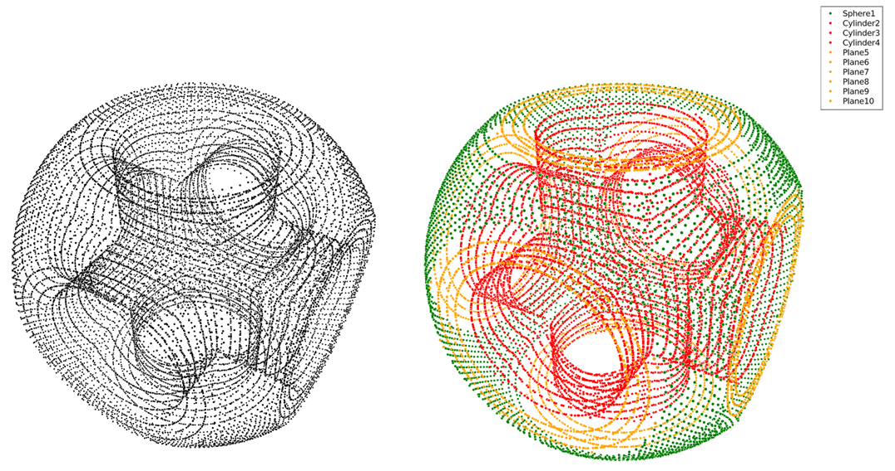

# RANSAC.jl

<!--

-->

This package implements the efficient RANSAC algorithm for point clouds.
Paper can be found [here](https://cg.cs.uni-bonn.de/en/publications/paper-details/schnabel-2007-efficient/).

> 	R. Schnabel, R. Wahl, R. Klein
	"Efficient RANSAC for Point-Cloud Shape Detection",
	in Computer Graphics Forum, Vol. 26, No. 2, pages 214-226,
	Blackwell Publishing, June 2007

## Efficient RANSAC

The efficient RANSAC algorithm is used to detect primitive shapes in point clouds.
Primitive shapes can be: plane, sphere, cylinder, cone and torus, though torus is not implemented yet.

The input of the algorithm is a point cloud with associated surface normals.
The output is a set of primitive shapes with corresponding sets of points, and the rest of the points that do not belong to any primitives.

Here's an example with a point cloud and the detected primitives according to their type.

