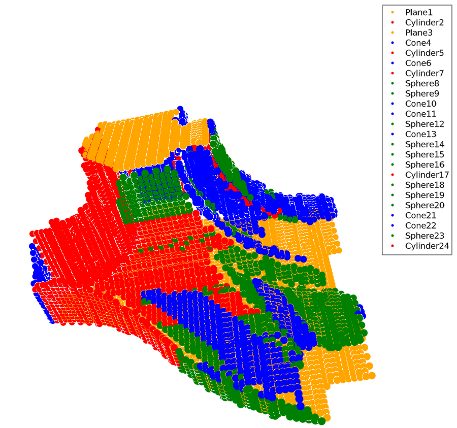

# Example

This page guides you through the use of RANSAC.jl.
A public dataset is used, that was published by Schnabel et al. and is accessible [here](https://cg.cs.uni-bonn.de/en/publications/paper-details/schnabel-2009-completion/).
> R. Schnabel, P. Degener, R. Klein
> "Completion and Reconstruction with Primitive Shapes",
> in Computer Graphics Forum (Proc. of Eurographics), Vol. 28, No. 2, pages 503-512


Read the algorithm description here to get a full understanding of the algorithm and its parameters.


## Loading the data

As MeshIO and other softwares had troubles opening the `_input.obj` files, I used [MeshLab](http://www.meshlab.net/) to open them and export to non-binary encoded PLY.

```julia
julia> using FileIO

julia> m = load("fandisk_input.obj")
HomogenousMesh(
    faces: 17513xGeometryTypes.Face{3,GeometryTypes.OffsetInteger{-1,UInt32}},     vertices: 8935xGeometryTypes.Point{3,Float32},     normals: 8935xGeometryTypes.Normal{3,Float32}, )
```

## Constructing a `PointCloud`

Currently the package only handles vectors of `Float64`.

```julia
julia> using RANSAC

julia> pc = PointCloud(m.vertices, m.normals, 8)
PointCloud{Array{StaticArrays.SArray{Tuple{3},Float64,1,3},1},Array{Array{Int64,1},1},Array{Float64,1}}
PointCloud of size 8935 & 8 subsets
```

## Set the parameters

Check the [Short description](@ref) and [Parameters](@ref) pages to understand the parameters.

```julia
julia> p = ransacparameters()
(iteration = (drawN = 3, minsubsetN = 15, prob_det = 0.9, shape_types = UnionAll[FittedPlane, FittedCone, FittedCylinder, FittedSphere], τ = 900, itermax = 1000, extract_s = :nofminset, terminate_s = :nofminset), common = (collin_threshold = 0.2, parallelthrdeg = 1.0), plane = (ϵ = 0.3, α = 0.08726646259971647), cone = (ϵ = 0.3, α = 0.08726646259971647, minconeopang = 0.03490658503988659), cylinder = (ϵ = 0.3, α = 0.08726646259971647), sphere = (ϵ = 0.3, α = 0.08726646259971647, sphere_par = 0.02))

julia> newparams = (ϵ=0.05, α=deg2rad(10),)
(ϵ = 0.05, α = 0.17453292519943295)

julia> p = ransacparameters(p, sphere=newparams, cone=newparams, plane=newparams, cylinder=newparams, iteration=(τ=50, itermax=100_000,))
(iteration = (drawN = 3, minsubsetN = 15, prob_det = 0.9, shape_types = UnionAll[FittedPlane, FittedCone, FittedCylinder, FittedSphere], τ = 50, itermax = 100000, extract_s = :nofminset, terminate_s = :nofminset), common = (collin_threshold = 0.2, parallelthrdeg = 1.0), plane = (ϵ = 0.05, α = 0.17453292519943295), cone = (ϵ = 0.05, α = 0.17453292519943295, minconeopang = 0.03490658503988659), cylinder = (ϵ = 0.05, α = 0.17453292519943295), sphere = (ϵ = 0.05, α = 0.17453292519943295, sphere_par = 0.02))
```

## Run!

The `ransac()` function runs the iteration.

```julia
julia> _, extr, _ = ransac(pc, p, true, reset_rand=true);
```

## See the results

The [RANSACVisualizer](https://csertegt3.github.io/RANSACVisualizer.jl/stable/) package provides a few utility functions to check the results (check the docs for function signatures).

### Check the input

The `showgeometry()` function shows a mesh and its normal vectors:

```julia
julia> showgeometry(m, arrow=0.3; show_axis = false)
```


### Results colored randomly

The `showshapes()` function provides this functionality.

```julia
julia> showshapes(pc, extr; show_axis = false)
```


### Results colored according to their type

The `showbytype()` function provides this functionality.

```julia
julia> showbytype(pc, extr; show_axis = false)
```


