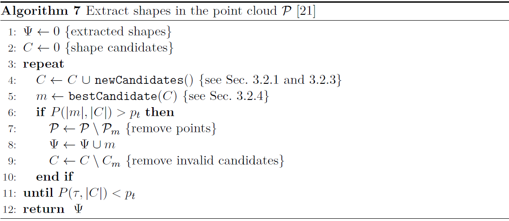

# Efficient RANSAC

This is a longer description of the RANSAC paradigm, shamelessly copied from [my master's thesis](https://gitlab.com/cserteGT3/masterthesis) (still based on `Schnabel2007`).

The [Short algorithm description](@ref) section introduces the concept and the steps of the algorithm (which are also shown in the following picture).
Hereby we describe the steps in more details.


## Primitive fitting

Considered shapes are planes, spheres, cylinders, cones and tori.
For these methods not only the points ``\{p_1, p_2, p_3\}`` are needed but the corresponding surface normals ``\{n_1, n_2, n_3\}``, as well.
If normal information is not available, there are algorithms to approximate it (PCA for example).
With the presence of normals, the shapes can be approximated from only one or two samples.
However, an additional sample can be used to immediately verify a candidate, and thus reduce the number of many relatively low scored shapes.

**Plane**: In the case of planes, three points define a plane and their normals are used to validate the fit.
A candidate is only accepted if the deviations of the three normals and the fitted normal are less than a predefined angle ``\alpha``.

**Sphere**: A sphere is fully defined by two points and their normals.
Of course, in the presence of noise, the two lines determined by the point-normal pairs do not meet at the centre of the sphere, therefore the midpoint of the shortest line segment between the two lines is used as a centre.
Then the mean of the distance from the centre to the two points is taken as the sphere radius.
The sphere is rejected if not all three points are in the ``\epsilon`` band of the sphere surface, or the normals deviate by more than an ``\alpha`` angle from the computed normals.

**Cylinder**: For cylinders, the cross product of two normals gives the axis of the cylinder.
A centre point can be computed by projecting the two lines (determined by the point-normal pairs) onto the plane defined by the axis and taking their intersection.
The radius of the circle is then set to the distance of the centre and one point on that plane.
As always, the compatibility of all three points is tested.

**Cone**: Although the cone is defined by two points and normals, all three are used for its recognition.
The apex (``c``) is found by intersecting the three planes defined by the point-normal pairs.
The axis (``a``) is given by the normal of the plane defined by the three points ``\{c+\frac{p_1-c}{\|p_1-c\|}, \ldots, c+\frac{p_3-c}{\|p_3-c\|}\}``.
The opening angle is given as ``{\omega=\frac{\sum_{i} \arccos((p_i-c)\cdot a)}{3}}``.
The cone is also verified by compatibility before becoming a candidate.

**Torus**: as the torus was not implemented in the scope of this thesis, the reader is guided to Section 4.1 in `Schnabel2007`.

The original paper does not elaborate more on the direction of the normals, but while implementing we took some notes that worth sharing.
First let us introduce the terms positive and negative shapes.
A positive shape means that the normals point from the centre or axis of the shape towards outside and of course negative shape means the opposite.
When the compatibility is determined we must take the positivity/negativity into account, which means that all the normals should similarly be positive or negative.
If they are different, the candidate is discarded.
This is mainly a noise filtering step to ensure the appropriate shapes, but one may use this information to accelerate the CSG-tree reconstruction with additional a priori information.

## Computational complexity

The complexity of the algorithm is dominated by two major factors: the number of minimal sets that are drawn, and the cost of evaluating the score for every candidate shape.
Let ``P`` be a point cloud consisting of ``N`` points and therein a shape ``\psi`` of size ``n``.
Let ``k`` denote the minimum number of points required to define the shape, also called a minimal set.
If we assume that every ``k`` points will result in an appropriate candidate, the probability of detecting ``\psi`` in a single pass:

```math
P(n) =  \binom{n}{k} \bigg/ \binom{N}{k} \approx   \bigg( \frac{n}{N}  \bigg)^k.
```

The probability of finding the candidate in the first ``s`` samples (drawing a new minimal set ``s`` times) equals to the probability of the complementary of ``s`` consecutive failures:

```math
P(n,s) =  1 - (1 - P(n))^s.
```

The first two equations will be used later to calculate the extraction and termination criteria.
After a short deduction, we can conclude that the asymptotic complexity of the RANSAC algorithm is

```math
O\left(\frac{1}{P(n)}C\right),
```

where ``C`` denotes the cost of evaluating the cost function.

To summarize the equations: the size of the minimal set should be as small as possible, and a good sampling strategy is crucial, as the runtime complexity is directly linked to the success rate of finding good sample sets.

## Sampling

As shapes are local phenomena, the smaller the distance between two points, the higher the probability that they belong to the same shape.
This should be exploited during sampling.
To establish spatial proximity, an octree data structure is used[^1].
The first sample of a minimal set is chosen randomly from the entire point cloud.
Then an octree cell is chosen which includes the selected point and rest of the points (``k-1`` pcs.) are drawn randomly from this cell.

Selection of the proper octree level is an essential part of the sampling strategy.
Of course, we would like to choose the level so that the probability of a "good cell" is as high as possible.
Therefore the cell is chosen from a level according to a non-uniform distribution that reflects the likelihood of the respective level to contain a good cell.
The probability ``P_l`` of a level ``l`` is initialized with ``P_l=\frac{1}{d}`` where ``d`` is the depth of the octree.
Then for every level, the score (``\sigma_l``) of previously scored candidates that originate from the corresponding level is summed and the distribution is updated:

```math
\hat{P}_l = x\frac{\sigma_l}{w P_l} + (1-x)\frac{1}{d},
```

where ``w = \sum_{i=1}^{d} \frac{\sigma_i}{P_i}``.
During the iteration, the distribution is continuously changing as more and more shapes are extracted from the point cloud.
Setting ``x=0.9`` ensures that ``10\%`` of the samples are always uniformly distributed among the levels.
This enables the sampling algorithm to handle the changing importance of levels as points are removed from the point cloud.
In one iteration of the RANSAC algorithm, not only one but ``t`` number of minimal sets are sampled.
This is because sampling is computationally cheap compared to the rest of the iteration, and there are cases when no primitives fit the minimal set.

## Score

The ``\sigma`` score measures the quality of a given shape candidate.
The score is equal to the number of compatible point-normal pairs.
A point is compatible if it satisfies all the following requirements:

* It must be in the ``\epsilon`` radius band of the surface of the candidate.
* The normal must not deviate from the surface normal at the point more than an ``\alpha`` angle.
* The point must be part of the largest connected component in the parameter space bitmap of the shape.

As mentioned earlier when the normals are compared the positivity/negativity is also taken into account.

The connected component criterion is a noise filtering step, however, in our implementation it is not considered.
Based on our experiments, synthetic tests work without the bitmapping step, but of course, when this method is applied for real-world measurements, it is certainly needed.
Our experiences have also shown that the algorithm is easier to fine-tune if there are separate epsilon and alpha parameters for every primitive type (i.e. ``\epsilon_{sphere}``, ``\alpha_{sphere}``, ``\epsilon_{plane}``, etc.).

## Score computing

The second major performance factor of the RANSAC algorithm is evaluating the score of the candidates.
A naive implementation could be that we compute the compatibility of all the points, but it is not reasonable for large point clouds.
At this stage of the algorithm, we are not interested in all the points that correspond to a candidate, but we would like to determine which shape consists of the most points.
Therefore the computational cost can be reduced if the overall score is inferred from the score calculated for a smaller subset.

The point cloud is partitioned into ``r`` number of disjoint random subsets: ``\mathcal{P}=\{\mathcal{S}_1 \ ... \ \mathcal{S}_r\}``.
When the score is calculated, the candidate is scored only against the first subset (denoted by ``\sigma_{\mathcal{S}_1}``).
From this value, an approximation is given for the complete point cloud (``\sigma_p``) using the well-known induction from inferential statistics:

```math
\hat{\sigma}_{\mathcal{P}}(\psi) = -1- \xi (-2-|\mathcal{S}_1|, -2-|\mathcal{P}|, -1-\sigma_{\mathcal{S}_1}(\psi)),
```

where

```math
\xi (N,x,n) = \frac{xn \pm \sqrt{\frac{xn(N-x)(N-n)}{N-1}}}{N}
```

is the mean plus/minus the standard deviation of the hypergeometric distribution.
The result of the approximation is a confidence interval ``[a,b]`` that gives a range of likely values of the exact score.
The one with the largest expected value ``E=(a+b)/2`` is considered the best shape.
Of course, if the confidence interval of the best one intersects with other intervals we cannot be sure that the best is really the best.
Therefore further refinement -- evaluation of the score for more subsets -- is needed.
This part is not implemented in the scope of this thesis, corresponding equations and methodology can be found in Section 4.5.1 of `Schnabel2007`.
This scoring method has some additional effects on the way bitmaps are generated, these aspects are also described in the paper.

## Termination and extraction conditions

Two important questions have not been addressed yet: how it is decided when to extract the best candidate (``\psi_m``) and when to terminate the iteration.
We aim to minimize the likelihood to extract a candidate that is not the best, therefore, we track the probability ``P(\psi_m,s)`` where ``s`` denotes the number of candidates that have already been drawn.
``P(\psi_m,s)`` is the likelihood that after drawing ``s`` candidates ``\psi_m`` is the best.
If it is higher than a threshold (``p_t``) we conclude that there is a low chance that we have overlooked a better candidate, and extract ``\psi_m``.
The termination condition is similar, ``P(\tau,s)`` is observed, where ``\tau`` denotes a parameter, the minimum size of the shapes.

Implementation of these conditions seems straightforward, but based on the paper it is not clear what ``s`` exactly denotes.
It can mean two things:

* The number of candidates that are in set ``C`` at that given iteration.
* The number of minimal sets that have been drawn. At the ``i``-th iteration, this equals to ``i \cdot t``.

Based on our experiments, the first results in bad performance, because it takes many iterations to collect enough candidates to increase ``P(\psi_m,s)`` and extract the shapes.
When using the second one, ``s`` increases fast, therefore candidates are quickly extracted, however, for the same reason, the algorithm might terminate too early.
In this case, one must pay attention to the minimal shape size (``\tau``), as larger values may cause early termination.

## Extraction

When the best candidate is selected for extraction, refitting is executed before it is finally accepted.
In the paper it is done as follows: a least-square fit is calculated to all compatible points that are within ``3\epsilon`` distance from the shape.
This is another noise filtering step that optimizes the geometric error of the shape.
Then the shape is extracted, the candidate is removed from set ``C``, and its corresponding points are removed from the point cloud.
Also, those candidates that have points removed are marked as invalid, and also deleted.
In our implementation least-square fitting is not used, only the compatible points are searched in the whole point cloud.

## Summary of parameters

The following table summarizes the different parameters and annotations of the RANSAC algorithm.
Only those parameters are listed that are described in the thesis.

| Parameter | Description | Suggested value (`Schnabel2007`) |
| :---: | :--- | :---: |
| ``\mathcal{P}`` | Input point cloud. | - |
| ``N`` | Size of the input point cloud. | - |
| ``C`` | Collection of shape candidates. | - |
| ``p_t`` | Probability threshold. | ``99\%`` |
| ``\tau`` | Minimum size of shape candidates. | - |
| ``\epsilon_{prim}`` | Compatibility parameter for distance. | - |
| ``\alpha_{prim}`` | Compatibility parameter for angle of the normals. | - |
| ``k`` | Size of the sampled minimal set. | 3 or 4 |
| ``s`` | Number of candidates at the given iteration. | - |
| ``d`` | Octree depth. | - |
| ``\sigma_l`` | Sum of scores of shapes generated from octree level ``l``. | - |
| ``P_l`` | Likelihood that level ``l`` contains a good cell. | - |
| ``t`` | Number of sampled minimal sets in one iteration. | - |
| ``r`` | Number of subsets. | - |
| ``\hat{\sigma}_{\mathcal{P}}(\psi)`` | Approximate score of shape ``\psi``. | - |

[^1]: An octree is a tree data structure in which each internal node has exactly eight children.
